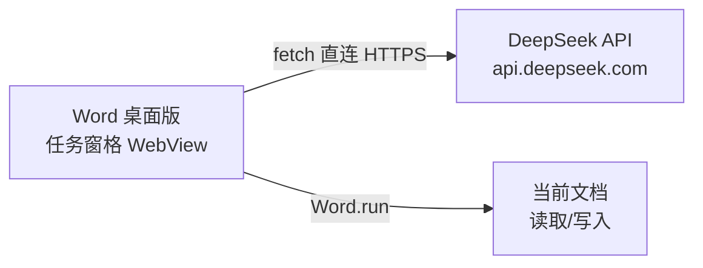

# DeepSeek 文档助手（Word 桌面版 · 无本地服务版）

一个运行在 Microsoft 365 **Word 桌面版**侧边栏（任务窗格）的 Office 加载项：在侧边栏与 DeepSeek 对话，模型可以看到你当前选中的文字，回复生成后一键替换选中内容、插入光标处、插入文首或文末。

**本版本不需要本地服务**：不需要安装 Node.js，不需要运行任何服务，电脑上没有任何常驻进程。任务窗格页面一次性托管到任意免费静态网站后，即可长期使用。

## 与上一版（本地代理版）的区别

| | 旧版 | 本版 |
| --- | --- | --- |
| 运行依赖 | 需要 Node.js + 本地运行 server.js | 无 |
| 页面来源 | 本机 http://localhost:3000 | 任意静态托管网站（一次性部署） |
| DeepSeek 调用 | 经本地代理转发 | 浏览器直连官方 API |
| 适用环境 | 网页版 + 桌面版 | 仅 Word 桌面版 |
| 需要常驻进程 | 是 | 否 |

## 工作原理



- DeepSeek 官方 API 已实测返回浏览器跨域（CORS）允许头，因此任务窗格可以直接调用，无需中间服务。
- 任务窗格页面必须是 http(s) 地址（微软 Office 平台限制，不支持本地文件路径），所以页面需要放在任意静态托管上；**托管是一次性上传，之后不需要运行任何东西**。

## 目录结构

```
├─ manifest.xml           # Office 加载项清单（需替换占位域名后使用）
├─ app/                   # 需要整体上传到静态托管的内容
│  ├─ taskpane.html       # 任务窗格页面
│  ├─ taskpane.css
│  ├─ taskpane.js         # 聊天逻辑 + 直连 DeepSeek + Word 文档读写
│  └─ assets/             # 加载项图标（16/32/80）
└─ scripts/
   └─ gen_icons.mjs       # 可选：重新生成图标（需要 Node，仅开发时用）
```

## 部署状态（已完成）

本项目的页面已部署到 GitHub Pages，`manifest.xml` 中的地址也已全部替换为正式地址：

- 仓库：<https://github.com/TAP-APIA/word-deepseek-assistant>
- 页面：<https://tap-apia.github.io/word-deepseek-assistant/taskpane.html>

以后修改功能时，更新 `app/` 目录下的文件并推送到 GitHub 仓库即可自动生效（`deploy/` 目录就是该仓库的本地工作副本）。

### 最后一步：加载到 Word 桌面版（共享文件夹目录）

1. 新建文件夹，例如 `C:\WordAddins`，把改好的 `manifest.xml` 复制进去。
2. 打开 Word → **文件 → 选项 → 信任中心 → 信任中心设置 → 受信任的加载项目录**。
3. 在"目录 URL"填入 `C:\WordAddins`，点击 **添加目录**，勾选 **在菜单中显示**，确定后**重启 Word**。
4. 点击 **插入 → 加载项 → 我的加载项 → 共享文件夹**，选择 **DeepSeek 文档助手**。
5. 功能区"开始"选项卡出现 DeepSeek 分组，点击 **DeepSeek 助手** 打开侧边栏。

以后每次使用：直接打开 Word → 插入 → 我的加载项 → DeepSeek 文档助手即可，**电脑上无需运行任何程序**。

## 使用说明

1. 首次使用点击侧边栏右上角 ⚙，填入 DeepSeek API Key（平台：platform.deepseek.com），可切换模型（`deepseek-chat` / `deepseek-reasoner`）。
2. 在 Word 里选中一段文字，勾选"附带选中内容"。
3. 输入指令，例如：
   - "把选中的段落润色得更正式一些"
   - "根据选中内容写一份 200 字的中文摘要"
   - "把文档开头部分翻译成英文"
4. 发送后等待流式回复，然后点击底部按钮应用：

   | 按钮 | 效果 |
   | --- | --- |
   | 替换选中内容 | 用回复替换当前选中文字 |
   | 插入光标处 | 插入到光标位置（选中内容之后） |
   | 插入文首 / 插入文末 | 插入到文档开头 / 结尾 |

> 提示：在输入框按 `Ctrl+Enter` 可直接发送。

## 常见问题

**为什么还是需要"托管"？**
这是 Office 平台的硬性限制：加载项的任务窗格页面必须来自 http(s) 地址，不支持本机文件路径。托管只是把几个静态文件放上去（一次性的），你的电脑上不需要运行任何服务。

**打开插件提示"API Key 无效（401）"**
检查设置中的密钥是否正确、是否已复制完整；或去 DeepSeek 平台确认密钥状态。

**提示"余额不足（402）"或"请求过于频繁（429）"**
分别表示账户余额不足或触发限流，稍后重试或前往平台处理。

**加载项列表里找不到插件**
确认 manifest.xml 已在受信任目录中、URL 已全部替换、并且**重启过 Word**。

**页面打不开 / 空白**
先在浏览器直接打开 <https://tap-apia.github.io/word-deepseek-assistant/taskpane.html> 确认可用。若打不开，通常是 github.io 在国内网络需要代理才能访问（Word 加载项会跟随系统代理，一般不受影响）。

**换电脑或重装后 API Key 没了**
Key 保存在本机浏览器的本地存储里，需要在新电脑上重新填写一次。

**想发布给其他人使用**
需要把加载项提交到 Microsoft 365 管理中心或 AppSource 做集中部署，属于正式发布流程，与个人自用不同。

## 安全说明

- API Key 保存在本机浏览器本地存储中，请勿在共享电脑上长期保存。
- 文档上下文按你的勾选发送给模型，涉及机密文档时请自行斟酌。
- 静态托管请使用 HTTPS（上面推荐的平台默认都是）。
